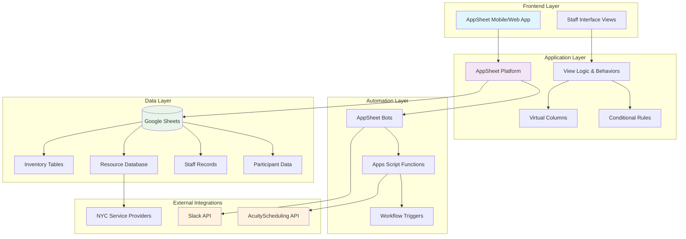

# MJO Dashboard

This repository documents the full AppSheet-based **MJO Dashboard**, an internal tool built to support daily office operations at Manhattan Justice Opportunities.

The dashboard serves as a centralized platform for staff to manage client appointments, track participant flow, fulfill phone requests, access resources, and coordinate real-time tasks — all from a single interface. It integrates with Slack and AcuityScheduling to push and pull appointment information as well as send messages based on business logic.

## Architecture Overview

## Technology Stack

- **Frontend**: AppSheet views and behavior logic
- **Backend**: Google Sheets (data tables and schemas)
- **Automation Layer**: AppSheet bots and custom Apps Script functions
- **Integrations**: Slack API, AcuityScheduling API

## Documentation Structure

The documentation below is organized by feature. Each folder contains:
- View definitions and UX logic
- Table schemas and data relationships
- Conditional visibility rules, actions, and virtual columns
- Any relevant scripts or backend automation

---

## Feature Modules

| Module | Description | Key Functionality |
|--------|-------------|------------------|
| [**Home**](./home/) | Central dashboard and team coordination | Check-in tools, team schedule, key metrics aggregation |
| [**Resource Portal**](./resource-portal/) | NYC service provider database | Curated directory of external resources and services |
| [**Supplies**](./supplies/) | Inventory management system | Tracks distributed items (clothing, hygiene kits, etc.) |
| [**Phones**](./phones/) | Communication workflow | Phone request handling with Slack integration |
| [**Donations**](./donations/) | Donation tracking system | Incoming donations and inventory flow management |
| [**MJO Staff**](./mjo-staff/) | Staff administration | User permissions, staff directory, role management |
| [**Special Instructions**](./special-instructions/) | Participant notes system | Critical participant-specific precautions and notes |

## Getting Started

### Prerequisites
- Access to the MJO AppSheet application
- Google account with appropriate permissions
- Staff credentials for dashboard access

### Access Information
The dashboard is accessible through:
- **Mobile App**: AppSheet mobile application
- **Web Interface**: Browser-based AppSheet portal
- **Integration Points**: Slack workspace, AcuityScheduling system

## Impact & Usage

- **Active Users**: 35+ staff members
- **Annual Reach**: Supports services for over 3,000 participants
- **Operational Coverage**: Daily office operations and client coordination

## Maintenance & Support

- **Documentation Updates**: Feature documentation evolves with system changes
- **Data Backup**: Automated through Google Sheets integration
- **System Monitoring**: Real-time status through AppSheet platform

## Contributing

When updating documentation:
1. Follow the established folder structure for each feature module
2. Include view definitions, table schemas, and automation logic
3. Document any new integrations or API connections
4. Update this README when adding new modules

---

*Last updated: August 2025*
