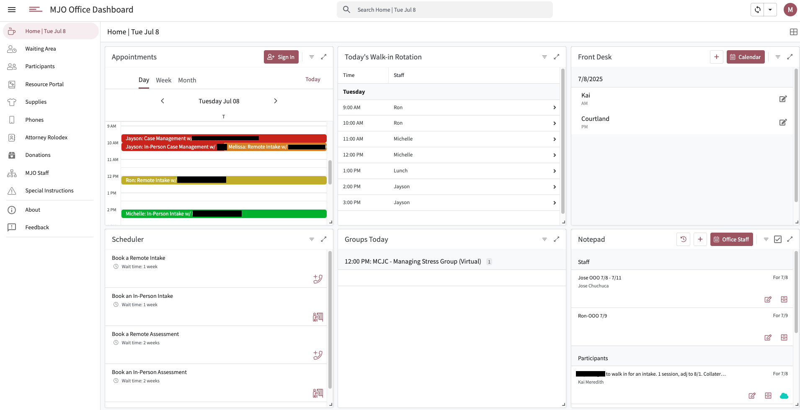

# MJO Dashboard

This folder documents the full AppSheet-based **MJO Dashboard**, an internal tool built to support daily office operations at Manhattan Justice Opportunities.

The dashboard serves as a centralized platform for staff to manage client appointments, track participant flow, fulfill phone requests, access resources, and coordinate real-time tasks — all from a single interface. It integrates with Slack and AcuityScheduling to push and pull appointment information as well as send messages based on business logic.

---

## ⚙️ Platform Overview

- **Frontend**: AppSheet views and behavior logic
- **Backend**: Google Sheets (data tables and schemas)
- **Automation Layer**: AppSheet bots and custom Apps Script functions
- **Integrations**: Slack API, AcuityScheduling API

The documentation below is organized by feature. Each folder contains:
- View definitions and UX logic
- Table schemas and data relationships
- Conditional visibility rules, actions, and virtual columns
- Any relevant scripts or backend automation

---

## 📂 Feature Breakdown

| Feature            | Description                                                      |
|--------------------|------------------------------------------------------------------|
| [home](./home/)                  | Central dashboard aggregating key views, check-in tools, and team schedule       |
| [resource-portal](./resource-portal/)   | Curated database of NYC service providers        |
| [supplies](./supplies/)               | Inventory of distributed items (e.g., clothes, hygiene kits)   |
| [phones](./phones/)                   | Phone request and fulfillment workflow, integrated with Slack     |
| [donations](./donations/)             | Tracks received donations and inventory flow                      |
| [mjo-staff](./mjo-staff/)             | Staff list, permissions, and user-level customization              |
| [special-instructions](./special-instructions/)| Records participant-specific precautions or notes           |

---

## Notes

- This dashboard is actively used by 35+ staff and supports services for over 3,000 participants annually.
- View-by-view documentation will continue to evolve as features are added or refactored.
