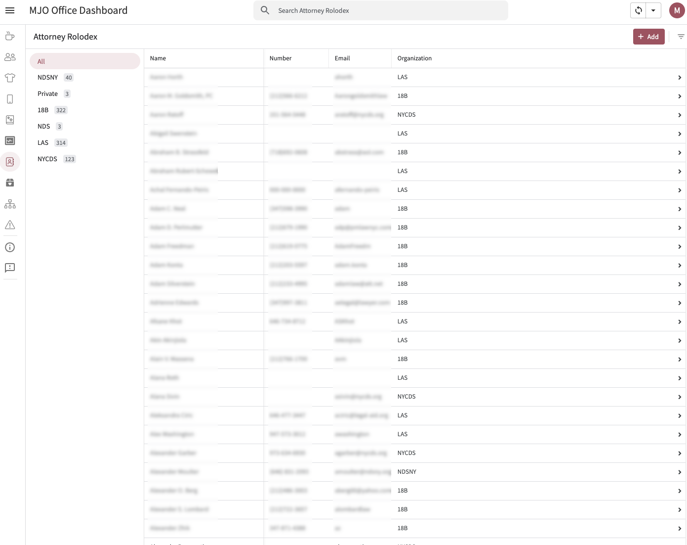

# ⚖️ Attorney Rolodex

The **Attorney Rolodex** is a searchable directory of defense attorneys, grouped by agency. The team can look up attorneys quickly, add new entries, and keep existing records current as contacts change.

## Purpose & Overview

MJO works closely with defense agencies whose attorneys refer and represent participants. The Rolodex centralizes that contact information in one place so the team isn't hunting through emails or spreadsheets to find who to reach out to.

## Features

- **Grouped by agency:** attorneys are organized under their respective defense agencies, making it easy to browse by office
- **Searchable:** the table supports search so the team can find a specific attorney by name or agency quickly
- **Editable:** the team can add new attorneys or update existing records directly from the view as contacts change

---

## AppSheet Setup

### 🧱 View Configuration
- **Type:** Table
- **Grouping:** Defense Agency
- **Search:** Enabled

---
