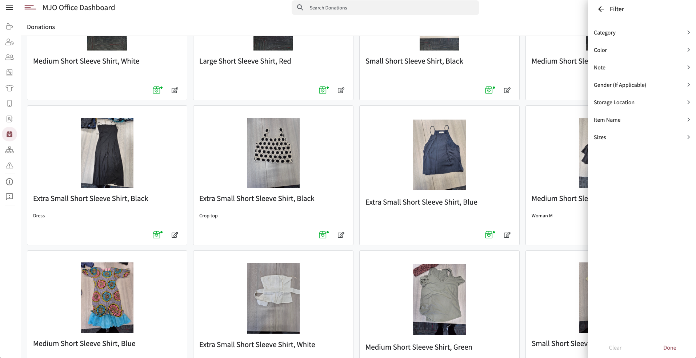
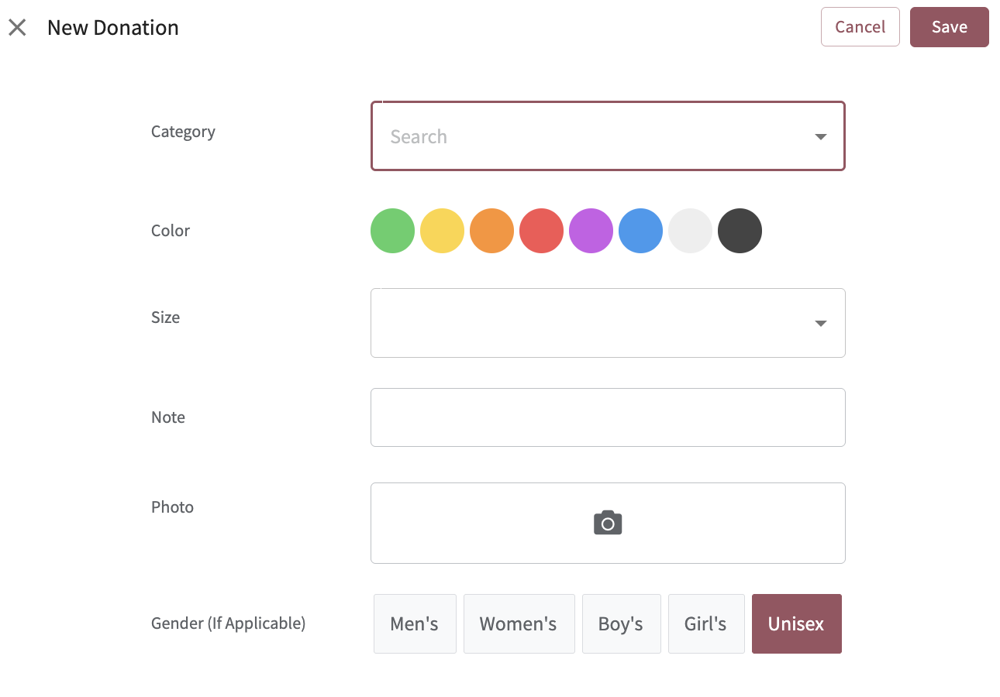

# 🧥 Donations | MJO Dashboard

The **Donations** feature is a simple in/out inventory system that allows MJO staff to donate gently used clothing items and for case managers or social workers to distribute those items directly to participants.

This system ensures that donations are searchable, categorized, and easy to track—avoiding duplicate distributions and improving client access to basic needs in real-time.

## 🎁 Adding a Donation

Staff click the **Add** button to open the **New Donation** form.

Form Fields:
- **Category**
- **Color**
- **Size**
- **Note**
- **Photo**
- **Gender (if applicable)**

Once submitted, the item is added to the live donations catalog.

## 📦 Distribution Workflow

When a case manager or social worker finds an item a participant needs, they can click the **Distribute** action. This removes the item from the catalog, preventing it from being double-distributed.

No complex logic—just a reliable, streamlined way to make donated clothing accessible when it’s needed most.

---