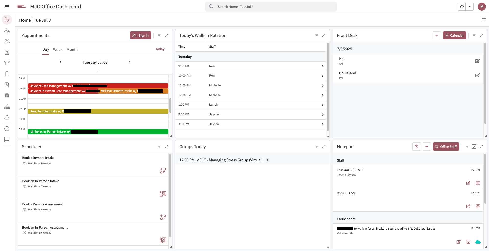
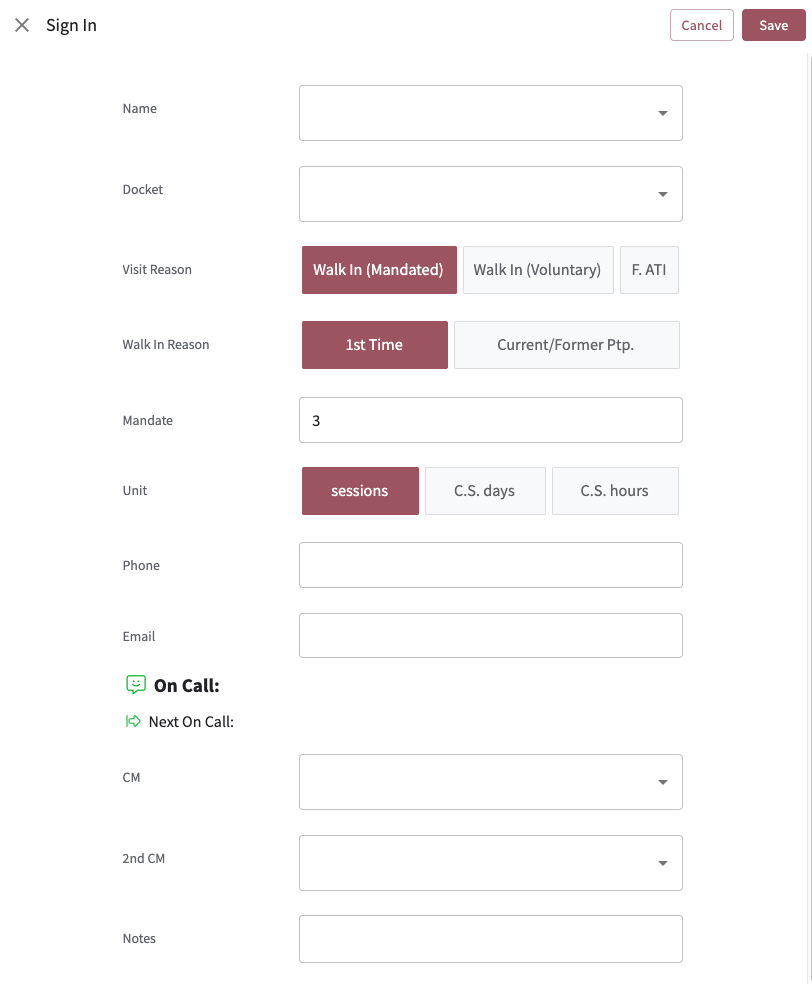
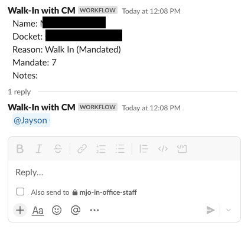

# 🏠 Home View

The **Home** view serves as the central operational dashboard for daily office operations, providing staff with a real-time overview of appointments, participant check-ins, and front desk workflows. This dashboard dynamically displays the current date and consolidates multiple data streams to create a comprehensive view of daily activities.



**[Jump to AppSheet Setup](#appsheet-setup)**

## Purpose & Overview

The Home view functions as the primary landing screen for staff, designed to streamline daily client interactions and provide immediate visibility into scheduled appointments and walk-ins. It integrates with AcuityScheduling API to pull real-time appointment data and features automated workflows that connect appointment management to participant logging systems.

Key capabilities include:
- **Real-time appointment calendar** with integrated check-in functionality
- **Quick action buttons** for common front desk operations
- **Dynamic date display** that updates automatically throughout the day
- **Seamless workflow integration** connecting appointments to participant tracking
- **Automated notifications** via Slack webhooks for team coordination

## Sign In & Check In Workflows

The Home view supports two primary methods for managing participant arrivals, each designed for different scenarios:

### Quick Check In Action
The **Quick Check In** button appears directly within the appointment calendar for scheduled visits. When staff click this action, it automatically creates a new entry in the Participant Log table with pre-populated information from the appointment (participant name, appointment type, case manager, and notes). This streamlined process reduces friction during busy periods by eliminating manual data entry and immediately routing participants to the "Waiting Area" status.

### Sign In Form (Walk-ins)
For participants arriving without scheduled appointments, the **Sign In** navigation action routes staff to a dedicated form at the front desk. This comprehensive workflow captures detailed participant information and visit reasons, making it ideal for walk-in scenarios that require more context.



## Slack Integration

Both check-in methods trigger automated Slack notifications to keep the team informed of participant arrivals:

- **Scheduled appointments** (Quick Check In): Notifications are sent to the office channel when participants check in for their appointments
- **Walk-in participants** (Sign In form): When a case manager is assigned during sign-in, the system sends a notification to the in-office channel and tags the specific case manager in a thread

This integration ensures that case managers are immediately aware when their participants arrive, whether for scheduled appointments or unexpected visits.



---

## AppSheet Setup

### 🧱 View Configuration
- **Type**: Dashboard
- **Display Name Formula**:  
  ```appsheetscript
  CONCATENATE("Home | ", TEXT(NOW(), "ddd MMM D"))
  ```
- **Visibility Condition**:
  ```appsheetscript
  useremail() <> "mjo80conf@gmail.com"
  ```
  *This hides the Home view on the iPad used for inventory.*

### 🧩 Subview: Appointments
**View Type**: Calendar  
**Table**: `Appointments`

**View Options:**
| Setting        | Value               |
|----------------|---------------------|
| Start Date     | `Appointment Date`  |
| Start Time     | `Appointment Time`  |
| End Date       | `Appointment Date`  |
| End Time       | `endtime`           |
| Description    | `Type with Participant` |
| Category       | `Case Manager`      |
| Default View   | `Day`               |

### ⚡ Action: Check In
This **Quick Action** appears prominently in the Appointments calendar and creates a new row in the `Participant Log` table when staff mark someone as checked in.

| Attribute         | Value |
|------------------|-------|
| **Type**          | `Data: add a new row to another table` |
| **Target Table**  | `Participant Log` |
| **Set Columns**   | See below |
| **Position**      | `Prominent` |
| **Show If**       | `OR(CONTAINS([Case Manager], "In-Person"), CONTAINS([Appointment Type], "In-Person"))` |
| **Confirmation**  | `CONCATENATE("Check In ", [Participant], "?")` |

**Set Column Values:**
```text
Name         = [Participant]
Visit Reason = [Appointment Type]
CM           = [Full Case Manager]
Notes        = [Notes]
Walk In Date = today()
Check In     = timenow()
Status       = "Waiting Area"
```

### 🔄 Action: Sign In (Navigation)
This action enables quick navigation from the Appointments calendar to the **Sign In** form at the front desk. While the "Check In" button provides rapid appointment check-ins, this action routes to the full sign-in workflow for walk-ins and detailed participant logging.

| Attribute        | Value |
|-----------------|-------|
| **Action Name**  | `Sign In` |
| **Type**         | `App: go to another view within this app` |
| **Target**       | `LINKTOVIEW("Sign In")` |
| **Table**        | `Appointments` |
| **Position**     | `Primary` |
| **Display Name** | `"Sign In"` |

<<<<<<< HEAD
### 🛎️ Front Desk Sign In Configuration
The Sign In form is configured to capture walk-in participants and trigger Slack notifications. When a case manager is selected during the sign-in process, the system automatically sends a notification to the in-office Slack channel and tags the assigned case manager in the thread.
=======
### 🛎️ Front Desk: Signing Participants In
This is the form that the front desk uses to sign in participants who do not have an appointment. By indicating the "CM" (case manager), this triggers a Slack webhook which notifies the in-office channel about the visitor, and tags the assigned CM in the thread of that post.


>>>>>>> 551c24b80ff433535313ae114974417f4cac3f6d

---

## 📎 Implementation Notes
- This dashboard is used live in office every day
- The Quick Check In action reduces friction by automatically logging arrivals with a timestamp and routing them to the "Waiting Area" flow
- The confirmation prompt helps prevent mis-clicks during rapid client check-ins
- The view dynamically updates throughout the day as new appointments are added or modified
- Slack integration ensures seamless team communication for both scheduled and walk-in participants

---
*This documentation reflects the current state of the Home view as of the latest AppSheet configuration.*