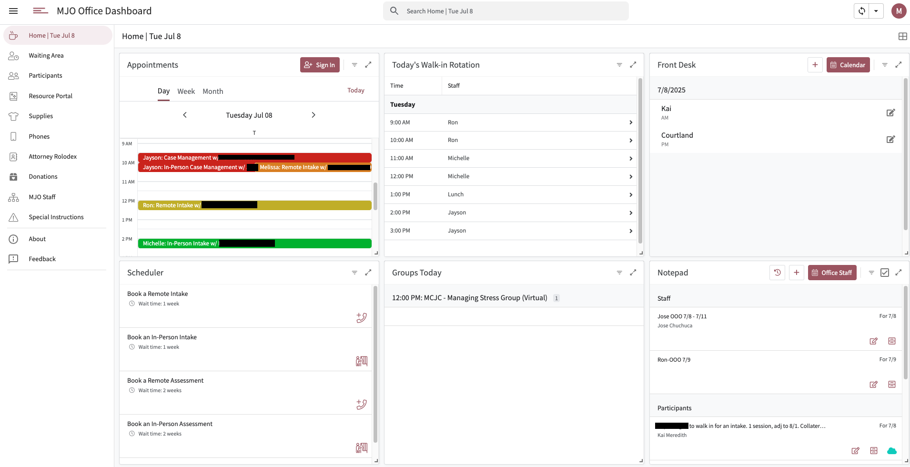
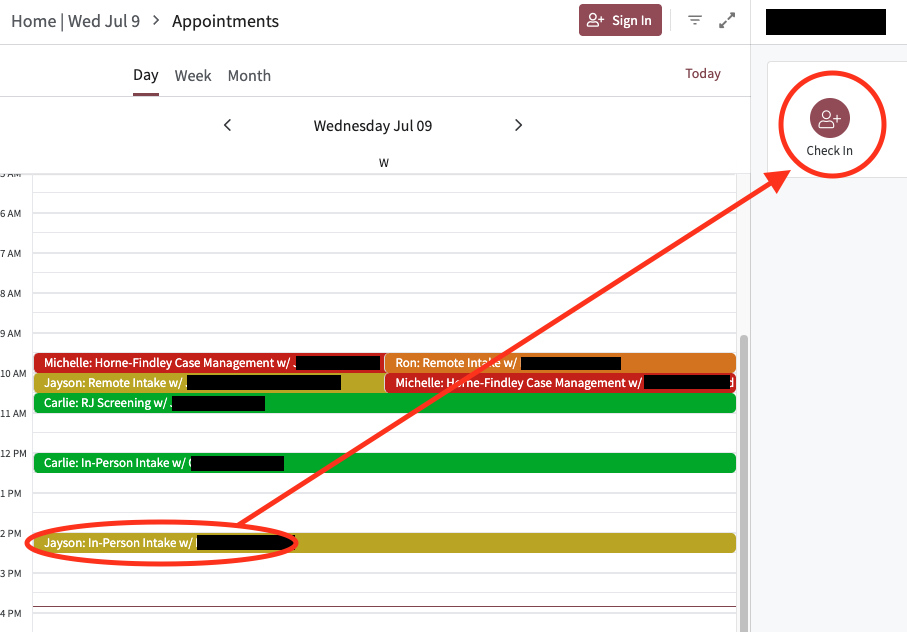
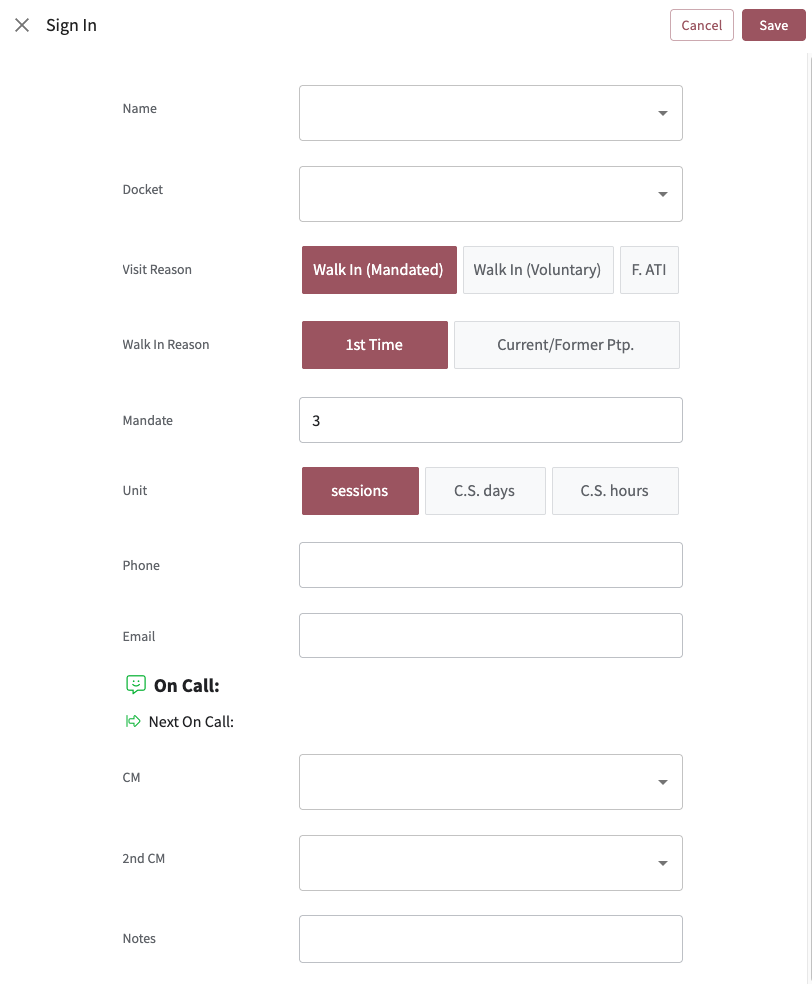
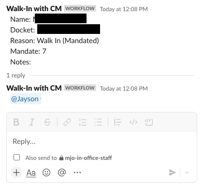

# Home View

The **Home** view is the central dashboard for daily office operations, giving staff a real-time view of appointments, participant check-ins, and front desk workflows. It displays the current date and consolidates appointments and check-ins for the day.



**[Jump to AppSheet Setup](#appsheet-setup)**

## Purpose & Overview

The Home view is the first screen staff see each day. It pulls live appointment data from AcuityScheduling and connects check-in actions directly to the participant log.

Key capabilities include:
- **Real-time appointment calendar** with integrated check-in functionality
- **Automated notifications** via Slack webhooks for team coordination
- **Walk-in rotation assignment** built into the Sign in form, making it easy for reception to assign clients to the right practitioners 

## Sign In & Check In Workflows

The Home view supports two primary methods for managing participant arrivals, each designed for different scenarios:

### Quick Check In Action
The **Quick Check In** button appears directly within the appointment calendar for scheduled visits. When staff click this action, it automatically creates a new entry in the Participant Log table with pre-populated information from the appointment (participant name, appointment type, case manager, and notes). This eliminates manual data entry during busy periods and immediately routes participants to the "Waiting Area" status.



### Sign In Form (Walk-ins)
For participants arriving without scheduled appointments, the **Sign In** navigation action routes staff to a dedicated form at the front desk. This form captures participant information and visit context for walk-ins.



## Slack Integration

Both check-in methods trigger automated Slack notifications in the in-office channel:

- The **Quick Check In** button sends a notification using the appointment’s details with one click.
- The **Sign In** form collects manual input by the receptionist, then sends a similar notification upon submission.

In both cases, if a case manager is assigned, the system tags them in a thread under the original Slack message. This ensures the team is immediately aware of participant arrivals and who’s responsible for follow-up.



---

## AppSheet Setup

### View Configuration
- **Type**: Dashboard
- **Display Name Formula**:  
  ```appsheetscript
  CONCATENATE("Home | ", TEXT(NOW(), "ddd MMM D"))
  ```
- **Visibility Condition**:
  ```appsheetscript
  useremail() <> "mjo80conf@gmail.com"
  ```
  *This hides the Home view on the iPad used for inventory.*

### Subview: Appointments
**View Type**: Calendar  
**Table**: `Appointments`

**View Options:**
| Setting        | Value               |
|----------------|---------------------|
| Start Date     | `Appointment Date`  |
| Start Time     | `Appointment Time`  |
| End Date       | `Appointment Date`  |
| End Time       | `endtime`           |
| Description    | `Type with Participant` |
| Category       | `Case Manager`      |
| Default View   | `Day`               |

### Action: Check In
This **Quick Action** appears prominently in the Appointments calendar and creates a new row in the `Participant Log` table when staff mark someone as checked in.

| Attribute         | Value |
|------------------|-------|
| **Type**          | `Data: add a new row to another table` |
| **Target Table**  | `Participant Log` |
| **Set Columns**   | See below |
| **Position**      | `Prominent` |
| **Show If**       | `OR(CONTAINS([Case Manager], "In-Person"), CONTAINS([Appointment Type], "In-Person"))` |
| **Confirmation**  | `CONCATENATE("Check In ", [Participant], "?")` |

**Set Column Values:**
```text
Name         = [Participant]
Visit Reason = [Appointment Type]
CM           = [Full Case Manager]
Notes        = [Notes]
Walk In Date = today()
Check In     = timenow()
Status       = "Waiting Area"
```


---

## Implementation Notes
- This dashboard is used live in office every day
- The Quick Check In action automatically logs arrivals with a timestamp and routes them to the "Waiting Area" flow
- The confirmation prompt helps prevent mis-clicks during rapid client check-ins
- The view dynamically updates throughout the day as new appointments are added or modified
- Slack integration ensures seamless team communication for both scheduled and walk-in participants

---
*This documentation reflects the current state of the Home view as of the latest AppSheet configuration.*