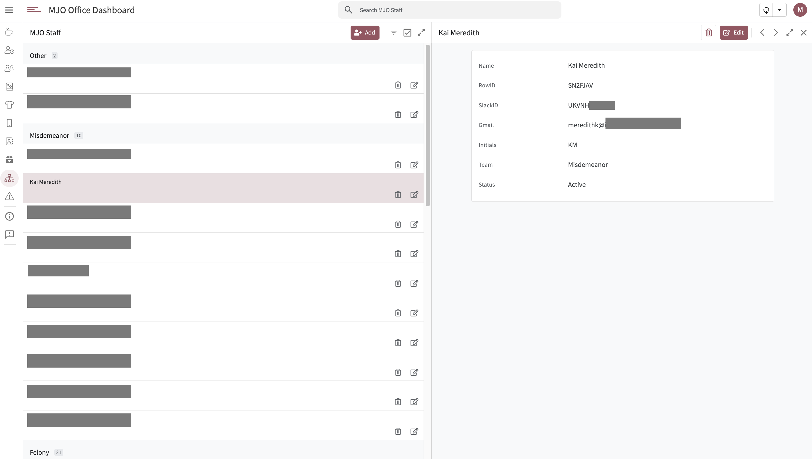

# MJO Staff Directory | MJO Dashboard

The **MJO Staff Directory** is a configuration tool that powers core functionality across the dashboard. It centralizes key identifiers needed for Slack messaging, user sessions, and appointment syncing.

## Adding a Staff Member

Supervisors add new staff via the **Add+** button, which opens a form with the following fields:

- **Name**
- **SlackID**
- **Gmail**
- **CalendarID**
- **Team**
- **Status**

### Required Fields and Their Purpose

- **SlackID**  
  Enables automated Slack notifications, such as direct messages when a client walks in. Without this, the system can't route alerts to the right person.

- **Gmail**  
  Used to authenticate staff access to the dashboard. All session-based filtering and role-based logic depends on matching this field.

- **CalendarID**  
  Links the staff member’s Acuity Scheduling calendar. This allows the Home view to pull in their upcoming appointments and ensures client check-ins trigger Slack alerts correctly.

## Summary

Adding new hires accurately ensures they are:
- Able to sign in and use the dashboard
- Properly notified of their clients’ activity
- Visible in team-wide logic like filtering and calendar syncing

