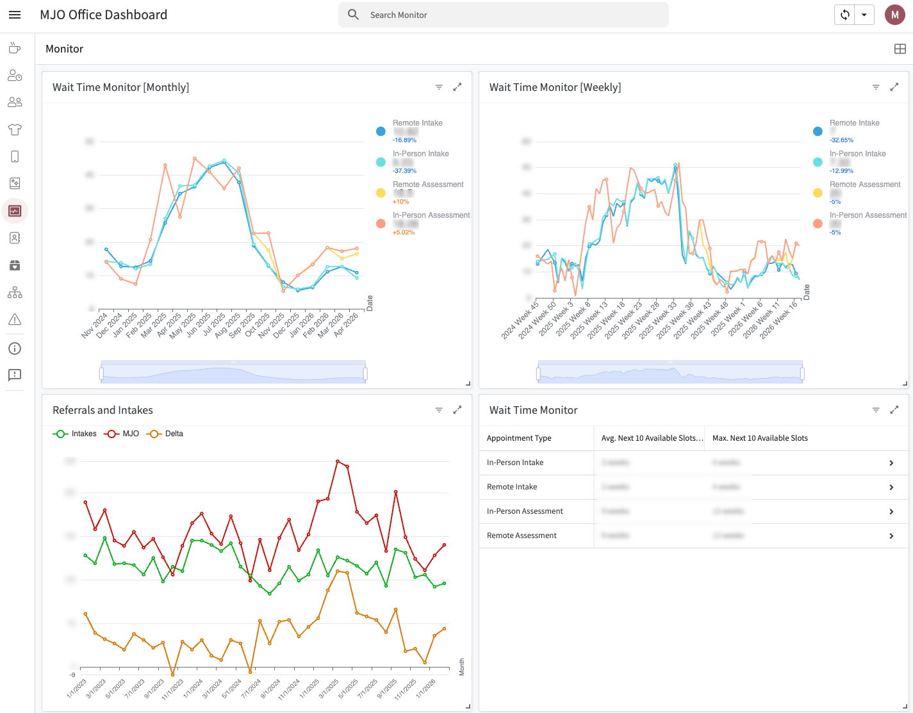

# 📊 Monitor

The **Monitor** view is an operational health dashboard that tracks appointment availability and intake throughput in real time. It gives leadership a clear picture of how quickly participants are being seen, how many referrals and intakes are being completed, and whether current staff capacity is keeping pace with demand — from both participants and the courts.

## Purpose & Overview

The Monitor view exists to answer one core operational question: are we keeping up? Appointment wait times, intake volume, and referral completions all intersect here to surface whether the office is striking the right balance between staff capacity, participant experience, and court expectations.

Courts refer cases to MJO with the expectation that participants are seen in a timely manner. If wait times grow too long, participant experience degrades and the office risks falling short of those obligations. Monitor makes that risk visible before it becomes a problem.

---

## Modules

### Appointment Wait Times — Weekly
A chart showing weekly appointment wait times over time. Tracks how many days participants are waiting for their next available appointment, week by week, giving a granular view of how capacity fluctuates.

### Appointment Wait Times — Monthly
The same wait time data aggregated by month, providing a longer-range trend line. Useful for identifying whether conditions are improving, stable, or deteriorating over time.

### Referrals & Intakes Completed
A monthly chart showing:
- **Referrals received** — cases referred to MJO by courts and other partners
- **Intakes completed** — participants who have completed the intake process
- **Delta** — the gap between the two, surfacing whether intake throughput is keeping pace with incoming referrals

A growing delta signals a backlog forming; a shrinking delta indicates the team is working through demand.

### Next Available Appointments Table
A table listing the next 10 available appointments by type (intakes and assessments), including:
- **Average wait time** (in days) across available slots
- **Maximum wait time** — the longest a participant would wait for the next opening

This table gives staff and leadership an immediate answer to "how long is someone going to wait if they call today?"

---

## Data Sources

| Module | Source | Method |
|--------|--------|--------|
| Wait time charts | AcuityScheduling | Apps Script crawls available appointments by type via API |
| Next available appointments table | AcuityScheduling | Same Apps Script, surfaces top 10 results with avg/max calculations |
| Referrals & intakes | Salesforce | Aggregated intake and referral data pulled into the dashboard |

The Apps Script iterates through AcuityScheduling appointment types (intakes and assessments) to find the next available slot for each, then surfaces those results into the wait time charts and the next available table.

---

## Why This Matters

Three competing pressures shape how MJO schedules appointments:

1. **Staff capacity** — practitioners have finite availability
2. **Participant experience** — long wait times erode trust and can cause people to disengage
3. **Court expectations** — referring courts expect cases to be seen promptly; delays reflect on the office's reliability as a partner

Monitor brings all three into a single view. If wait times spike, leadership can see it here and respond — whether that means adjusting practitioner schedules, adding intake capacity, or communicating proactively with referring courts.

---

## 📎 Implementation Notes

- Wait time data is pulled from AcuityScheduling via an Apps Script that crawls appointment availability by type; the script is scheduled to run on a regular cadence to keep the data current
- Intake and referral data is sourced from Salesforce and aggregated at the monthly level
- The next available appointments table is designed for quick operational reference — staff can check it at any time to give accurate wait time estimates to callers or walk-ins
- The delta in the referrals/intakes chart is the key metric to watch: it indicates whether the office is absorbing its caseload or falling behind

---

*This documentation reflects the current state of the Monitor view as of the latest AppSheet configuration.*
