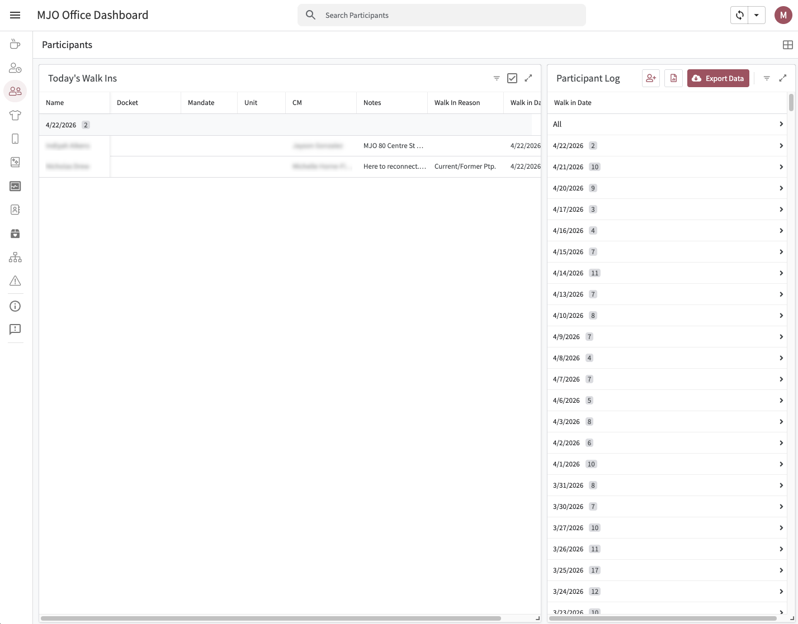
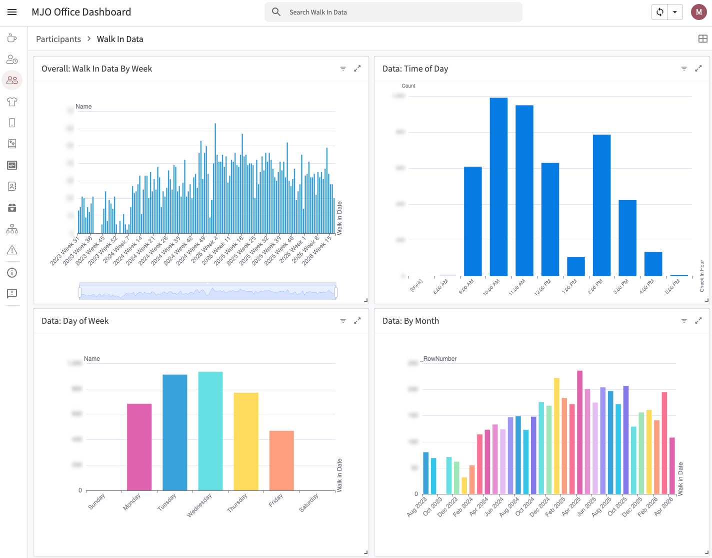

# 👥 Participants

The **Participants** view is a dual-purpose module that handles both real-time walk-in tracking and historical data visualization. It gives staff an at-a-glance view of who's in the office today while maintaining a full log of every participant who has ever walked in — and surfaces that data as charts to inform staffing decisions.

## Purpose & Overview

The Participants view serves two distinct but connected functions:

1. **Walk-in log** — a live, split-panel view showing today's arrivals alongside the all-time participant table
2. **Data visualization** — a chart dashboard that reveals patterns in walk-in traffic over time

Together, these features close the loop between day-to-day reception work and longer-term operational planning.

---

## Walk-in Log

The main Participants view is a split-panel layout:

- **Left panel — Today's Walk-ins**: Displays only participants who have walked in on the current date, giving front desk staff an instant snapshot of who's currently been seen or is waiting.
- **Right panel — All Participants**: A full historical table of every participant who has ever walked in, populated over time by the Sign In form on the Home view.

Both panels pull from the same underlying `Participant Log` table. The left panel filters by today's date; the right panel shows the complete record.

### How the Log Gets Populated

Participant records are created through the **Sign In form** on the Home view. Each time a walk-in is logged at the front desk, a new row is added to the `Participant Log` table, which flows into both panels here automatically.

---

## Data View

Clicking the **Data** button within Participants opens a chart dashboard built from the all-time participant log.

### Charts Included

| Chart | Description |
|-------|-------------|
| **Weekly Walk-ins Over Time** | All-time view of walk-in volume by week |
| **Time of Day** | Distribution of walk-ins by hour, showing peak arrival windows |
| **Day of Week** | Breakdown of walk-ins by day, revealing high- and low-traffic days |
| **Monthly (All-Time)** | Long-range monthly trend across the full history of the log |

### Why This Matters

Walk-in traffic is not evenly distributed — and staffing should reflect that. If participants consistently arrive on Tuesday mornings but rarely on Friday afternoons, the office can staff walk-in shifts accordingly. The Data view makes those patterns visible so scheduling decisions are driven by actual usage rather than assumption.

---

## AppSheet Setup

### 🧱 View Configuration

**Walk-in Log View**
- **Type**: Dashboard (split panel)
- **Left Panel**: Filtered deck/table view — `Walk In Date = today()`
- **Right Panel**: Full table view of `Participant Log`

**Data View**
- **Type**: Dashboard (chart panels)
- **Trigger**: Accessible via the `Data` navigation action within Participants

### 📊 Chart Configuration

Each chart in the Data view references the `Participant Log` table and aggregates by different time dimensions:

| Chart | X-Axis | Aggregation |
|-------|--------|-------------|
| Weekly Walk-ins | Week of `Walk In Date` | Count |
| Time of Day | Hour of `Check In` time | Count |
| Day of Week | Weekday of `Walk In Date` | Count |
| Monthly All-Time | Month of `Walk In Date` | Count |

---

## 📎 Implementation Notes

- The walk-in log updates in real time as new Sign In forms are submitted from the Home view
- The split-panel layout is intentional — staff need both "right now" and "full history" views simultaneously
- The Data view is designed for periodic review by leadership or whoever manages staffing schedules, not necessarily daily use
- Walk-in patterns revealed by the charts directly inform how walk-in shifts are assigned throughout the week

---

*This documentation reflects the current state of the Participants view as of the latest AppSheet configuration.*
