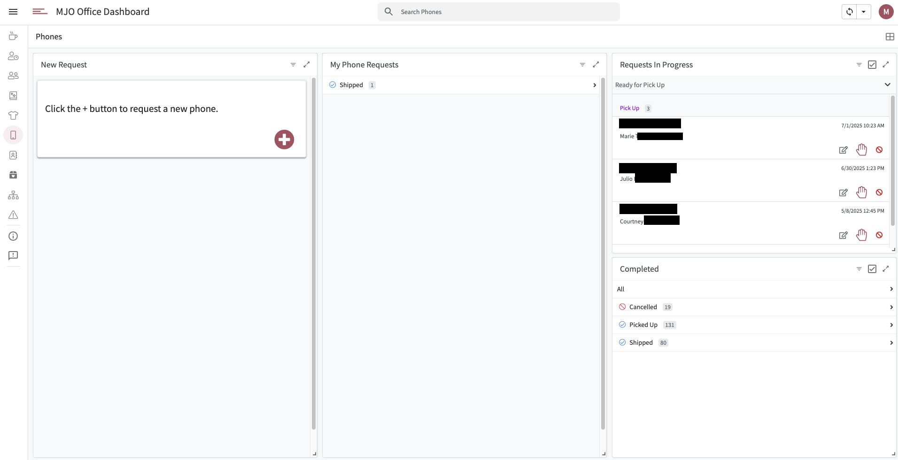

# 📱 Phones | MJO Dashboard



The **Phones** feature provides a structured, ticket-based system for requesting, tracking, and fulfilling mobile phone distribution requests for participants. It replaces the previous ad hoc method, which was error-prone and inefficient, with a more accountable and transparent workflow.

## 🔄 Workflow Overview

1. **Case Manager or Social Worker Action**
   - Clicks the "+" button to submit a new phone request.
   - Completes a form with:
     - Participant Name
     - Distribution Method (e.g., Delivery or Pick-Up)
     - Notes
     - Turnaround Time
     - *(Conditional)* Participant Address (only shown if Distribution Method = Delivery)
   - Upon submission, the request is added with a hidden `Status` field defaulting to **Pending**.

2. **Request Visibility**
   - Submitted requests appear in the **Requests in Progress** view.

3. **Slack Notification – New Request**
   - An AppSheet Bot is triggered:
     - **Event Source**: App
     - **Table**: Phone Distribution
     - **Data Change Type**: Add
     - **Action**: Call Webhook → Slack Workflow
     - **Payload**:
       ```json
       {
         "text": "New phone request: \nName: <<Participant Name>> \nPick Up Time: <<Turnaround Time>> \nDistribution Method: <<Distribution Method>> \nAddress: <<Participant Address>> \nNotes: <<Notes>> \nCase Manager: <<Case Manager>>",
         "SlackID": "<<SlackID>>"
       }
       ```

4. **Office Manager Fulfillment**
   - The office manager checks the dashboard.
   - Clicks **Update Status**, entering:
     - Phone Number
     - Update Notes
   - Selects one of two actions:
     - **Delivered**
     - **Ready for Pick-Up**
   - This updates the same row, maintaining linkage with the original request.

5. **Slack Notification – Fulfillment**
   - Another AppSheet Bot is triggered:
     - **Event Source**: App
     - **Table**: Phone Distribution
     - **Data Change Type**: Updates
     - **Action**: Call Webhook → Slack Workflow
     - **Payload**:
       ```json
       {
         "text": "The phone number for <<Participant Name>> is <<Phone Number>>. The phone is <<Status>>. Additional notes: <<Update Notes>>",
         "slackID": "<<SlackID>>"
       }
       ```

## ✅ Summary

This feature introduces:
- A **ticketed request flow** for better tracking
- **Slack-based real-time notifications** to reduce delays
- A **single-record update model** to keep all request data in one place

It streamlines phone distribution and improves clarity across roles.

## 🧭 System Diagram

```plaintext
+-------------------------------+
|  Case Manager / Social Worker |
+-------------------------------+
               |
               | 1. Submit Request via Form
               v
+----------------------------------+
|   Phone Distribution Table       |
| (New record with Status=Pending) |
+----------------------------------+
               |
               | 2. AppSheet Bot (On Add)
               v
+-------------------------------+
|   Slack Webhook Notification  |
|   (New Phone Request Alert)   |
+-------------------------------+
               |
               | 3. Office Manager Views Dashboard
               v
+---------------------------------+
|   Office Manager Updates        |
|   (Phone Number, Notes, Status) |
+---------------------------------+
               |
               | 4. AppSheet Bot (On Update)
               v
+-------------------------------+
|   Slack Webhook Notification  |
|   (Fulfillment Confirmation)  |
+-------------------------------+
```

---