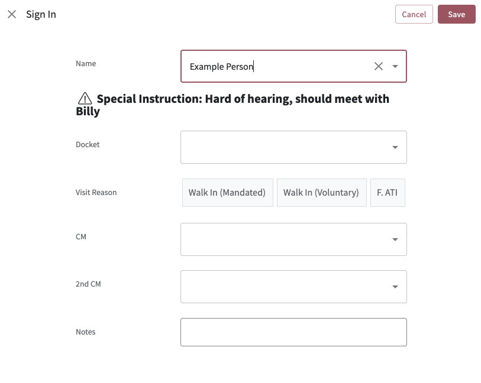
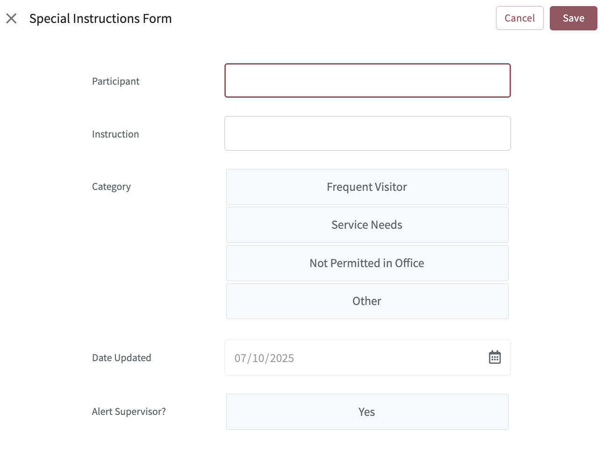

# Special Instructions | MJO Dashboard



The **Special Instructions** feature allows supervisors to flag important context for specific participants, from safety considerations to contextual notes. The team can see this information during check-in.

## Adding an Instruction

Supervisors click the **+ Add** button and are prompted to fill out a short form:



Form Fields:
- **Participant**
- **Instruction**
- **Category**: (`Frequent Visitor`, `Special Needs`, `Not Permitted in Office`, `Other`)
- **Alert Supervisor?**: Yes / No

Once submitted, the instruction is added to the `Special Instructions` table in the backend (Google Sheets).

## How It Works

When a participant is being signed in by front desk staff, the **Sign-In Form** conditionally shows a message if there's a matching instruction on file.

This is powered by a **virtual column** in the `MJO Participant Log` table:

- **Type**: `Show`
- **Condition**:
  ```appsheetscript
  IN([Name], Special Instructions[Participant])
  ```
- **Content (Text)**:
  ```appsheetscript
  IF(
    IN([Name], SELECT(Special Instructions[Participant], TRUE)),
    IF(
      ISNOTBLANK(
        LOOKUP([Name], "Special Instructions", "Participant", "Instruction")
      ),
      CONCATENATE(
        "Special Instruction: ",
        LOOKUP([Name], "Special Instructions", "Participant", "Instruction")
      ),
      CONCATENATE(
        "Category: ",
        LOOKUP([Name], "Special Instructions", "Participant", "Category")
      )
    ),
    ""
  )
  ```

This surfaces relevant context during sign-in so the team has the information they need.

---