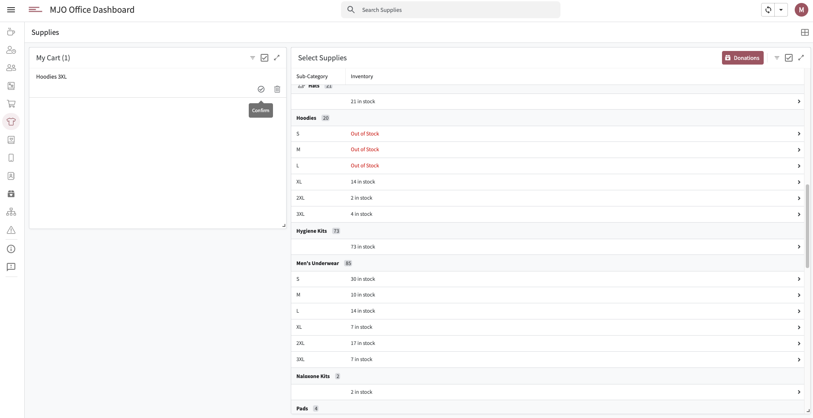

# Supplies - MJO Dashboard

[Jump to AppSheet Configuration](#appsheet-configuration)

## Overview

The Supplies feature is a real-time inventory management system that allows staff to check availability and check out items for clients. This streamlined supply distribution system maintains accurate inventory levels while providing a user-friendly interface for staff to quickly locate and distribute necessary supplies to participants.


## Purpose and Functionality

The Supplies system functions as a centralized inventory management tool where staff can view real-time supply availability, search for specific items, and check out supplies for client distribution. It eliminates inventory confusion and ensures accurate tracking of supply distribution across all staff members.

## Screenshots


*Main supplies interface showing inventory levels with search and cart functionality*

[↑ Jump to top](#supplies---mjo-dashboard)

## Key Features

### 1. **Real-Time Inventory Tracking**
- Live inventory level updates across all user sessions
- Automatic quantity adjustments upon checkout

### 2. **Searchable Supply Database**
- Quick search functionality across all supply items
- Filter by category, item name, or availability

[↑ Jump to top](#supplies---mjo-dashboard)

### 3. **Shopping Cart System**
- **Add to Cart**: Select items for checkout
- **Conditional Cart Display**: Cart appears only when items are selected
- **Quantity Management**: Adjust quantities before checkout
- **Session-Based**: Individual carts per user session

[↑ Jump to top](#supplies---mjo-dashboard)

### 4. **Checkout Process**
- **Confirm Checkout**: Final confirmation before inventory update
- **Transaction Recording**: Track who checked out what items
- **Clear Cart**: Reset cart after successful checkout


### 5. **User Session Management**
- **Individual Cart Sessions**: Each staff member has their own cart
- **Concurrent Access**: Multiple staff can use system simultaneously

[↑ Jump to top](#supplies---mjo-dashboard)

## User Interface Components

### Supply Display
Each supply item includes:
- **Item Name**: Primary identifier for supply
- **Category**: Classification of supply type
- **Current Inventory**: Real-time quantity available
- **Item Description**: Detailed information about the supply
- **Location**: Storage location within facility
- **Add to Cart Button**: Selection control for checkout

### Cart Interface
The shopping cart displays:
- **Selected Items**: List of items ready for checkout
- **Quantities**: Number of each item to be checked out
- **Inventory Impact**: Shows remaining quantities after checkout
- **Remove Items**: Option to remove items from cart
- **Checkout Button**: Confirm and process distribution

[↑ Jump to top](#supplies---mjo-dashboard)

### Action Controls
- **Search Bar**: Find specific supplies quickly
- **Add to Cart**: Select items for distribution
- **Quantity Adjustment**: Modify checkout quantities
- **Remove from Cart**: Remove unwanted items
- **Checkout**: Complete the distribution process


## AppSheet Configuration

### View Configuration

#### View Settings
- **View Name**: Supplies
- **View Type**: Gallery view with inventory display
- **Data Source**: Supplies Inventory table
- **Position**: Primary navigation position

#### Display Options
- **Primary Header**: Item Name
- **Secondary Header**: Category
- **Summary Column**: Current Inventory (with quantity display)
- **Search Configuration**: Enabled across item names and categories

#### Sorting and Grouping
- **Sort by**: Item Name (Ascending)
- **Group by**: 
  - Category (Ascending)
  - Item Name (Ascending)
- **Group aggregate**: SUM of Current Inventory

#### Action Bar Configuration
- **Show action bar**: Enabled
- **Actions**: Manual selection with the following options:
  - **Add to Cart**: Adds item to user's checkout cart
  - **View Details**: Display full item information
  - **Check Inventory**: Real-time inventory status

[↑ Jump to top](#supplies---mjo-dashboard)

### Cart System Implementation

#### Cart Table Structure
- **CartID**: Unique identifier for each cart entry
- **UserEmail**: Links cart to specific user session
- **ItemID**: References supply item
- **Quantity**: Number of items in cart
- **DateAdded**: Timestamp of cart addition

#### Add to Cart Action
- **Function**: Adds new row to Supplies Cart table
- **Referenced Data**: ItemID of selected supply
- **User Assignment**: Automatically uses USEREMAIL() function
- **Quantity Default**: 1 (adjustable in cart view)

#### Cart Display Logic
- **Conditional Visibility**: `COUNT(FILTER("Supplies Cart", [UserEmail] = USEREMAIL())) > 0`
- **User-Specific**: Shows only current user's cart items
- **Real-Time Updates**: Reflects changes immediately


### Technical Implementation Notes
- **User Authentication**: USEREMAIL() function for session management
- **Session Isolation**: User-specific cart functionality
- **Referential Integrity**: Proper linking between Supplies and Cart tables
- **Data Validation**: Prevents negative inventory levels
- **Concurrent Processing**: Handles multiple simultaneous users

### Slack Integration

A Slack integration is configured to notify the office manager when supply quantities fall to low levels. Specifically, when the quantity of any item reaches 3, a direct message is sent automatically.

#### Configuration Details

- **AppSheet Bot**
  - **Event Source**: App
  - **Table**: Inventory
  - **Data Change Type**: Updates
  - **Condition**: `[Quantity] = 3`
- **Action**
  - **Type**: Call a Webhook
  - **Destination**: Slack webhook that triggers a Slack workflow
  - **HTTP Request JSON Payload**:
    ```json
    {
      "text": "There are 3 left of <<Item>>."
    }
    ```

[↑ Jump to top](#supplies---mjo-dashboard)

## Best Practices

### For Staff Usage
1. **Cart Management**: Review cart contents before checkout
2. **Quantity Accuracy**: Ensure correct quantities are selected
3. **Immediate Checkout**: Complete checkout promptly to free up inventory
4. **Search Utilization**: Use search function for quick item location

[↑ Jump to top](#supplies---mjo-dashboard)

### For Inventory Management
1. **Regular Restocking**: Monitor inventory levels for reorder needs
2. **Accurate Counts**: Ensure physical inventory matches system records
3. **Category Organization**: Maintain clear categorization for easy searching
4. **Usage Monitoring**: Track distribution patterns for better planning

[↑ Jump to top](#supplies---mjo-dashboard)