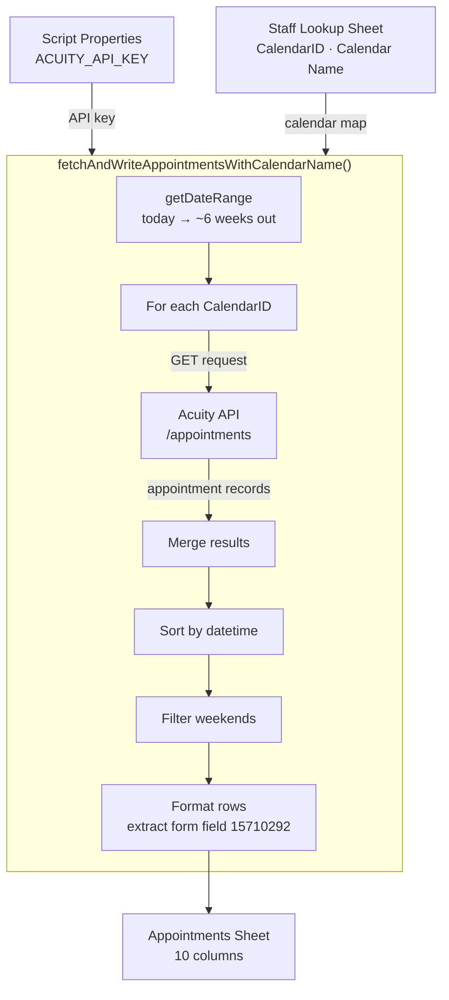

# Appointments Fetcher

A Google Apps Script tool that automatically pulls upcoming staff appointments from Acuity Scheduling and writes them to a Google Sheet, organized by case manager and filtered to weekday appointments only.

## Architecture

## Features

- **Acuity Integration**: Fetches appointments directly from the Acuity Scheduling API across all staff calendars
- **Dynamic Date Range**: Automatically calculates a rolling window from today through ~6 weeks out, ending on a Friday
- **Multi-Calendar Support**: Iterates over all calendars listed in the Staff Lookup sheet in a single run
- **Weekend Filtering**: Excludes Saturday and Sunday appointments from results
- **Form Field Extraction**: Pulls additional intake notes from a specific Acuity form field
- **Auto-Sort**: Results are sorted chronologically by appointment datetime

## Prerequisites

- Google Sheets access
- Acuity Scheduling account with API access
- A **Staff Lookup** sheet in the same spreadsheet with `CalendarID` and `Calendar Name` columns

## Installation

1. **Open your Google Sheets document**
2. **Open Apps Script**:
   - Go to `Extensions` → `Apps Script`
3. **Add the script**:
   - Paste the contents of `code.gs` into the editor
4. **Save the project**:
   - Give it a name like "Appointments Fetcher"
   - Save (Ctrl+S or Cmd+S)

## Setup

### 1. Configure the Staff Lookup Sheet

In your Google Sheets document, ensure there is a sheet named **"Staff Lookup"** with at least the following columns:

| CalendarID         | Calendar Name  |
|--------------------|----------------|
| 12345678           | Jane Smith     |
| 87654321           | John Doe       |

**To find Calendar IDs in Acuity:**
1. Log into your Acuity Scheduling account
2. Go to Business Settings → Availability
3. Click on a staff calendar — the ID appears in the URL

### 2. Set the Acuity API Key

The script reads credentials from Google Apps Script's PropertiesService:

1. In the Apps Script editor, go to `Project Settings` → `Script Properties`
2. Add a property named `ACUITY_API_KEY` with your Acuity API key as the value

> Your Acuity User ID is hardcoded in the script (`acuityUserId`). Update this value if the account changes.

## Usage

### Running the Script

1. In the Apps Script editor, select `fetchAndWriteAppointmentsWithCalendarName` from the function dropdown
2. Click **Run**
3. The script will:
   - Calculate the date range (today → next Friday ~6 weeks out)
   - Fetch appointments for every calendar in the Staff Lookup sheet
   - Filter out weekends and sort results chronologically
   - Clear and rewrite the **Appointments** sheet with updated data

### Output Sheet Structure

The **Appointments** sheet is populated with the following columns:

| Column | Description |
|--------|-------------|
| Appointment Date | Date formatted as `yyyy-MM-dd` (Eastern Time) |
| Case Manager | Staff member name from the Staff Lookup sheet |
| Appointment Time | Time formatted as `hh:mm AM/PM` (Eastern Time) |
| First Name | Client first name |
| Last Name | Client last name |
| Appointment Type | Acuity appointment type label |
| Notes | General notes from the appointment |
| CalendarID | Acuity calendar ID |
| Calendar Name | Staff member name (from lookup) |
| Additional Notes | Value from Acuity intake form field ID `15710292` |

## Troubleshooting

### Common Issues

**"Staff Lookup" sheet not found**
- Ensure the sheet is named exactly `Staff Lookup` (case-sensitive)
- Confirm it has `CalendarID` and `Calendar Name` column headers

**`ACUITY_API_KEY` not set**
- Go to Apps Script → Project Settings → Script Properties
- Add the key `ACUITY_API_KEY` with the correct Acuity API key value

**No appointments returned**
- Verify the Calendar IDs in the Staff Lookup sheet match the actual Acuity calendar IDs
- Check that appointments exist in Acuity for the upcoming date window
- Confirm the API key has not expired

**Failed to fetch for a specific calendar**
- Check the execution log in Apps Script for the specific response code
- A `401` means credential issues; a `404` means the Calendar ID is invalid

### Getting Help

1. **Check the execution log**: In Apps Script, open `Execution log` for detailed error output
2. **Test credentials manually**: Use the Acuity API directly at `https://acuityscheduling.com/api/v1/me` to verify your user ID and API key
3. **Verify form field ID**: If Additional Notes always returns `N/A`, confirm that field ID `15710292` matches the correct intake form field in your Acuity account

## Security Notes

- The Acuity API key is stored in Script Properties and is not visible in the spreadsheet
- The Acuity User ID (`acuityUserId`) is hardcoded — update it in the script if the account changes
- Credentials are scoped to the Apps Script project and not shared across spreadsheets
