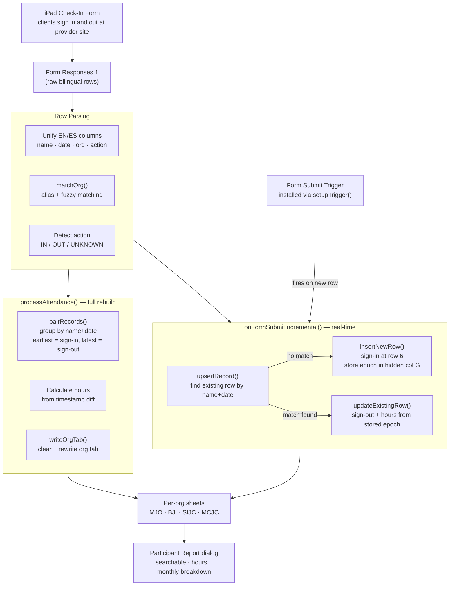

# Community Service Parser

A Google Apps Script tool that processes iPad check-in/check-out form submissions from community service providers, pairs sign-in and sign-out records by timestamp, calculates hours, and writes clean per-organization attendance tabs. Includes a real-time incremental trigger and an in-sheet participant report dialog.

## Architecture



## Features

- **Bilingual form support**: Unifies English and Spanish column sets from the same form into a single parsed record
- **Org alias matching**: Tolerant matching maps messy free-text org names (e.g. "Manhattan Justice Opportunities") to canonical codes (MJO, BJI, SIJC, MCJC)
- **Timestamp-based pairing**: Sign-in/sign-out pairs are determined by timestamp order — earliest submission = sign-in, latest = sign-out — ignoring the action field for reliability
- **Two processing modes**: Full rebuild (`processAttendance`) for clean resets; incremental trigger (`onFormSubmitIncremental`) for real-time updates without rebuilding
- **Hidden epoch column**: Stores sign-in timestamp as a Unix epoch (col G, hidden) so incremental sign-outs can calculate hours accurately
- **Participant Report dialog**: In-sheet modal with searchable name picker, total hours, monthly breakdown, and full attendance history — all rendered client-side with no server callbacks

## Prerequisites

- Google Sheets with a connected Google Form
- Form responses landing in a sheet named **Form Responses 1**
- The form must collect the fields described in the [Raw Data Format](#raw-data-format) section below

## Installation

1. **Open your Google Sheets document**
2. **Open Apps Script**:
   - Go to `Extensions` → `Apps Script`
3. **Add the script**:
   - Paste the contents of `code.gs` into the editor
4. **Save the project** (Ctrl+S or Cmd+S)
5. **Install the form submit trigger** — run `setupTrigger()` once (see [Setup](#setup))

## Setup

### 1. Install the Incremental Trigger

Run `setupTrigger()` once from the Apps Script editor to register the `onFormSubmit` trigger:

1. Select `setupTrigger` from the function dropdown
2. Click **Run**
3. Approve the permissions prompt

> Running `setupTrigger()` more than once is safe — it removes existing duplicates before creating a new one. Check `Triggers` in the Apps Script sidebar to confirm only one trigger exists.

### 2. Add New Orgs (if needed)

Supported orgs and their aliases are configured at the top of `code.gs`:

```javascript
const ORGS = ['MJO', 'BJI', 'SIJC', 'MCJC'];

const ORG_ALIASES = {
  'MJO':  ['mjo', 'manhattan justice opportunities', 'manhattan justice'],
  'BJI':  ['bji', 'brooklyn justice initiatives', 'brooklyn justice'],
  'SIJC': ['sijc', 'staten island justice center', 'staten island'],
  'MCJC': ['mcjc', 'midtown community justice center', 'midtown community'],
};
```

Add new entries to both `ORGS` and `ORG_ALIASES` to support additional organizations.

## Raw Data Format

The script expects **Form Responses 1** to have the following column layout (columns A–N):

| Col | English Field | Col | Spanish Field |
|-----|--------------|-----|--------------|
| A | Timestamp | — | — |
| B | Score | — | — |
| C | Preferred Language | — | — |
| D | First Name | I | Nombre |
| E | Last Name | J | Apellido |
| F | Today's Date | K | Fecha de Hoy |
| G | Organization | L | Organizacion |
| H | Sign In/Out | M | Entrada/Salida |
| N | Notes | — | — |

The parser reads whichever column set has data — English fields take priority, Spanish fields are the fallback.

## Usage

### Full Rebuild

Run `processAttendance()` to clear and rewrite all org tabs from scratch. Use this to:
- Initialize tabs on first run
- Clean up any data inconsistencies
- Reprocess after bulk form edits

To rebuild only one org, run `processMJO()` (or add similar wrappers for others).

### Real-Time Updates

Once `setupTrigger()` has been run, every new form submission automatically updates the correct org tab without a full rebuild. New sign-ins are inserted at the top of the data area; sign-outs find the existing row by name + date and fill in the sign-out time and calculated hours.

### Participant Report

1. Navigate to any org tab (MJO, BJI, SIJC, or MCJC)
2. Click the **Participant Report** menu → **Generate Report**
3. Type a client name in the search box to see:
   - Total hours completed
   - Number of attendances
   - Last attended date
   - Hours broken down by month
   - Full attendance history

### Output Sheet Structure

Each org tab (e.g. **MJO**, **BJI**) contains:

| Row | Content |
|-----|---------|
| 1 | Title: `{ORG} — Community Service Attendance` |
| 2 | Last updated timestamp |
| 3 | Summary: dates · unique participants · total records |
| 4 | *(blank spacer)* |
| 5 | Column headers (frozen) |
| 6+ | Data rows, sorted by date descending then name ascending |

Data columns:

| Column | Description |
|--------|-------------|
| A | Date (`M/d/yyyy`) |
| B | Full Name |
| C | Sign In time |
| D | Sign Out time |
| E | Hours (decimal, e.g. `1.50`) |
| F | Notes |
| G | *(hidden)* Sign-in epoch — used for incremental hour calculation |

## Troubleshooting

### Common Issues

**Org tab not created / client goes to wrong tab**
- Check that the org name entered on the form fuzzy-matches one of the aliases in `ORG_ALIASES`
- Check the execution log for unmatched org strings and add them to the aliases config

**Hours not calculating on sign-out**
- The hidden column G (sign-in epoch) must be populated on the sign-in row
- If the tab was built with an older version of `processAttendance()` that didn't write the epoch, run the full rebuild after applying the patch described in the code comments

**Incremental trigger not firing**
- Confirm the trigger exists: Apps Script → `Triggers` (clock icon) → look for `onFormSubmitIncremental`
- If missing, run `setupTrigger()` again

**Duplicate trigger running the script multiple times**
- Go to Apps Script → `Triggers` and delete extra `onFormSubmitIncremental` entries
- Run `setupTrigger()` once to reinstall a clean single trigger

**Participant Report shows "No participant data found"**
- Ensure you are on an org tab (MJO, BJI, SIJC, or MCJC) before opening the report
- Confirm the tab has been populated by running `processAttendance()` first

### Getting Help

1. **Check the execution log**: In Apps Script, open `Execution log` for per-row parse errors and unmatched org strings
2. **Test a single org**: Run `processMJO()` to isolate issues to one tab
3. **Inspect raw data**: Confirm **Form Responses 1** has data in the expected column positions

## Security Notes

- No external API calls or credentials required — this script reads only from the connected Google Form and writes within the same spreadsheet
- The Participant Report dialog embeds all data server-side as JSON; no `google.script.run` callbacks are used, avoiding per-user authorization prompts
