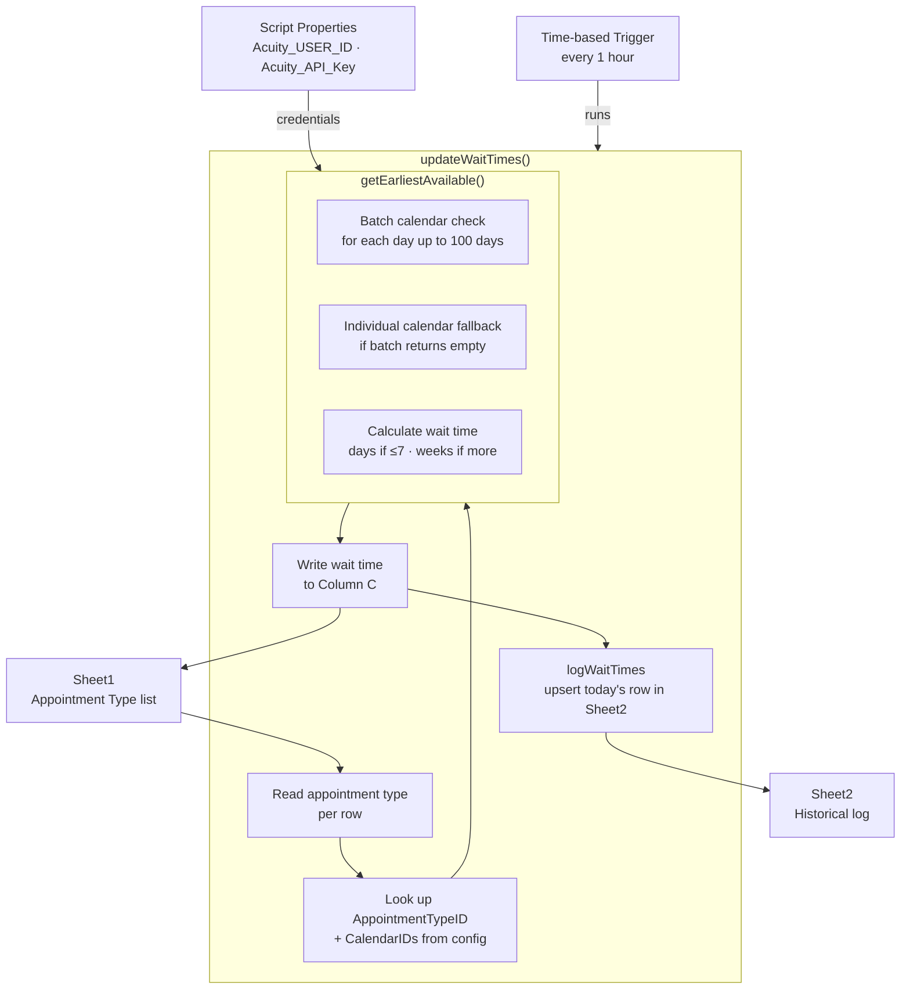

# Wait Times Tracker

A Google Apps Script tool that checks Acuity Scheduling availability across all staff calendars and writes current wait times for each appointment type back to a Google Sheet. Runs automatically on an hourly trigger and maintains a running historical log.

## Architecture



## Features

- **Hourly Automation**: A time-based trigger runs the full update every hour without manual intervention
- **Multi-Calendar Search**: Checks availability across up to 10 staff calendars per appointment type
- **Batched + Fallback Logic**: First queries all calendars in a single batched request; falls back to individual calendar checks if the batch returns no results
- **100-Day Lookahead**: Searches up to 100 days forward to capture long wait times accurately
- **Human-Readable Output**: Returns results in days (if ≤7) or weeks for at-a-glance readability
- **Historical Logging**: Appends daily records to a log sheet, deduplicating same-day entries on re-run

## Prerequisites

- Google Sheets access
- Acuity Scheduling account with API access
- **Sheet1** in the spreadsheet with appointment type names in column B (starting row 2)
- **Sheet2** for the historical log (created automatically with headers on first run)

## Installation

1. **Open your Google Sheets document**
2. **Open Apps Script**:
   - Go to `Extensions` → `Apps Script`
3. **Add the script**:
   - Paste the contents of `code.gs` into the editor
4. **Save the project**:
   - Give it a name like "Wait Times Tracker"
   - Save (Ctrl+S or Cmd+S)

## Setup

### 1. Configure Sheet1

Ensure **Sheet1** has the following structure (data starts at row 2):

| Column A | Column B | Column C |
|----------|----------|----------|
| *(any identifier)* | Remote Intake | *(written by script)* |
| *(any identifier)* | In-Person Intake | *(written by script)* |
| *(any identifier)* | Remote Assessment | *(written by script)* |
| *(any identifier)* | In-Person Assessment | *(written by script)* |

Column C (Current Wait Time) is overwritten on every run.

### 2. Set API Credentials

1. In the Apps Script editor, go to `Project Settings` → `Script Properties`
2. Add the following properties:

| Property | Value |
|----------|-------|
| `Acuity_USER_ID` | Your Acuity user ID |
| `Acuity_API_Key` | Your Acuity API key |

### 3. Set Up the Hourly Trigger

Run `setupTrigger()` once to register the hourly time-based trigger:

1. Select `setupTrigger` from the function dropdown in the Apps Script editor
2. Click **Run**
3. Approve the permissions prompt

> Only run `setupTrigger()` once — running it multiple times creates duplicate triggers. Check existing triggers under `Triggers` in the left sidebar before running.

### 4. Update Appointment Type Config (if needed)

The appointment types and their associated calendar IDs are hardcoded in `updateWaitTimes()`. Update the `appointmentTypes` map in `code.gs` if appointment type IDs or staff calendars change:

```javascript
const appointmentTypes = {
  "Remote Intake":      { id: 70516297, calendars: [...] },
  "In-Person Intake":   { id: 70517392, calendars: [...] },
  "Remote Assessment":  { id: 70517874, calendars: [...] },
  "In-Person Assessment": { id: 70517910, calendars: [...] }
};
```

## Usage

### Automatic (recommended)

Once `setupTrigger()` has been run, the script updates Sheet1 and logs to Sheet2 every hour with no further action needed.

### Manual Run

1. Select `updateWaitTimes` from the function dropdown in the Apps Script editor
2. Click **Run**

### Output

**Sheet1 — Current Wait Times**

| Column | Description |
|--------|-------------|
| A | Row identifier (unchanged) |
| B | Appointment type name |
| C | Current wait time (e.g. `3 days`, `2 weeks`, `No availability`) |

**Sheet2 — Historical Log**

| Column | Description |
|--------|-------------|
| Date | Timestamp of the run |
| Appointment Type | Appointment type name |
| Wait Time | Wait time at time of run |
| Soonest Date | Earliest available date (`yyyy-MM-dd`) |

Same-day re-runs update existing rows rather than appending duplicates.

## Troubleshooting

### Common Issues

**Wait time shows "Error fetching availability"**
- Check that `Acuity_USER_ID` and `Acuity_API_Key` are set correctly in Script Properties
- Verify the credentials work by testing against the Acuity API directly

**Wait time shows "No availability"**
- No open slots were found within 100 days across any of the configured calendars
- Confirm the appointment type IDs and calendar IDs in the `appointmentTypes` config are current

**Column C is not being updated**
- Confirm Sheet1 is named exactly `Sheet1` (case-sensitive)
- Ensure appointment type names in column B exactly match the keys in `appointmentTypes`

**Duplicate triggers running the script multiple times**
- Go to Apps Script → `Triggers` (clock icon) and delete any duplicate `updateWaitTimes` entries
- Only one hourly trigger should be active at a time

### Getting Help

1. **Check the execution log**: In Apps Script, open `Execution log` for per-calendar API response details
2. **Verify appointment type IDs**: Log into Acuity → Business Settings → Appointment Types and confirm IDs match the config
3. **Verify calendar IDs**: Log into Acuity → Business Settings → Availability and confirm staff calendar IDs

## Security Notes

- API credentials are stored in Script Properties and are not visible in the spreadsheet
- Credentials are scoped to the Apps Script project and not shared across documents
